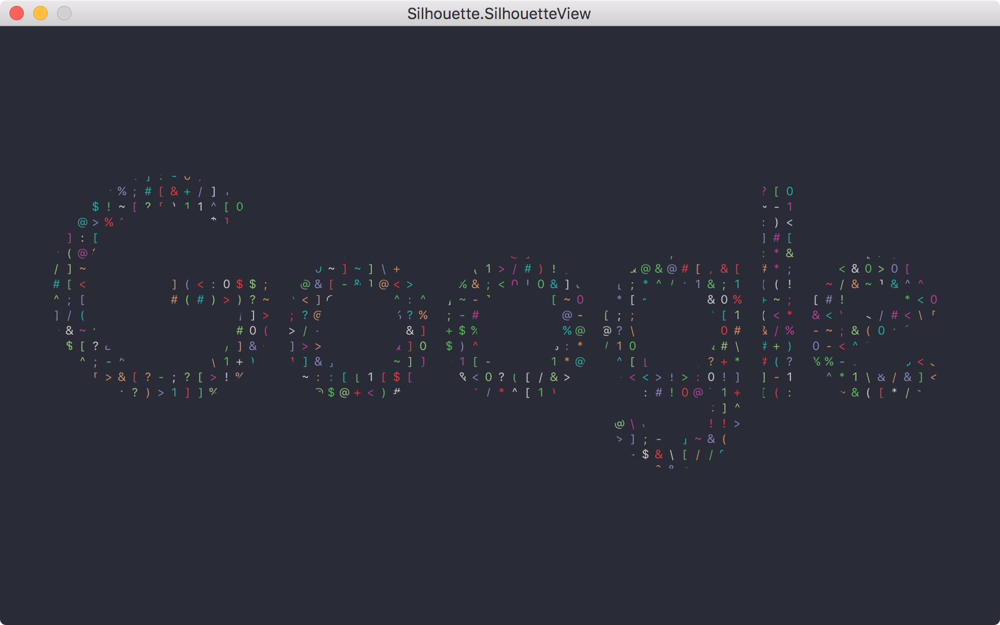
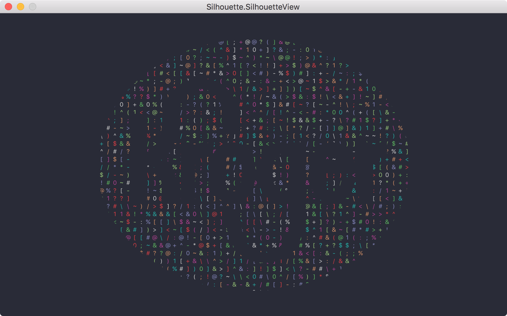
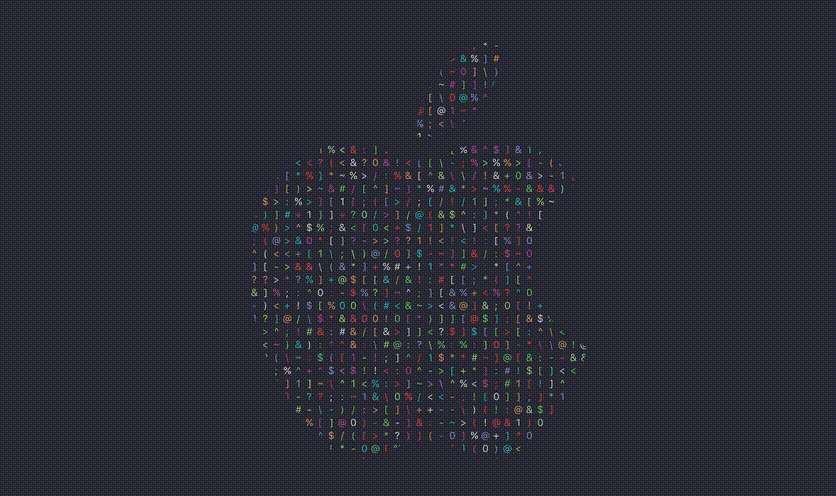
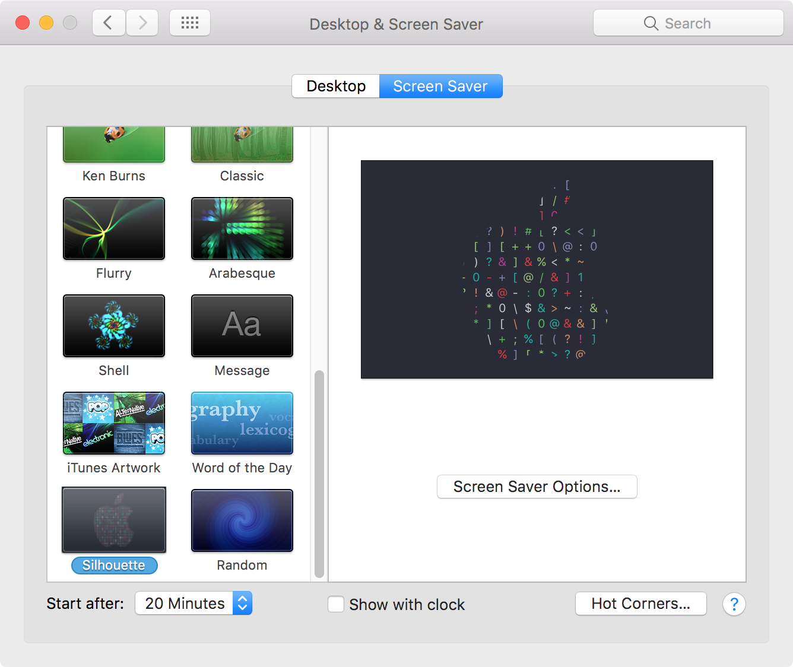
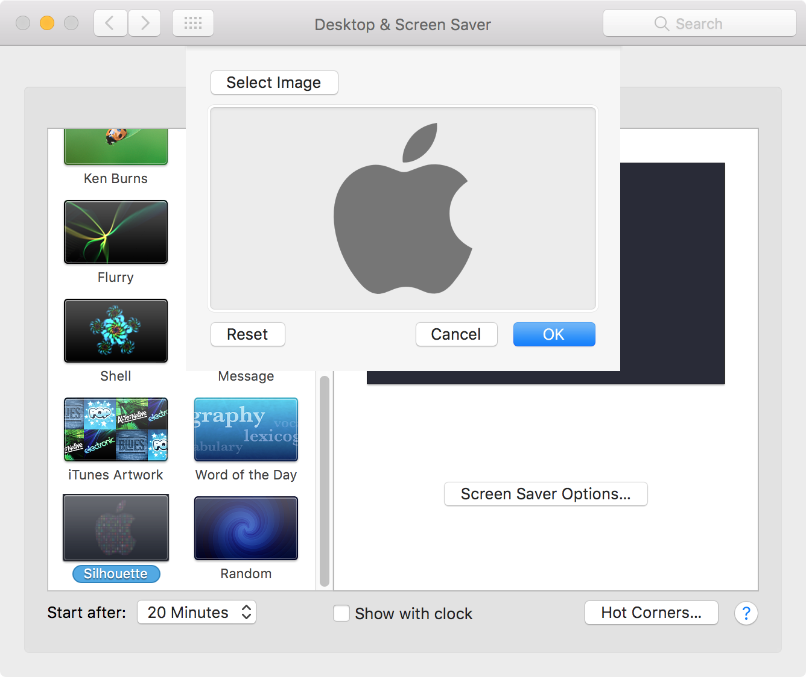

# Silhouette

## Overview

**Silhouette** is a MacOS screen saver written in Swift.  It allows you to select any transparent PNG file and use it as the silhouette.

## Examples

Google | Kroger
------------ | -------------
 | 

## Screenshots

Screen Saver - Animation



System Preferences - Screen Saver



System Preferences - Screen Saver Options



## Installation

After you install homebrew-cask, run the following command:

```sh
$ brew tap burnsra/personal
```

You can now install the Silhouette saver cask.

```sh
$ brew cask install silhouette-saver
```

[Direct Downloads](https://www.robertburns.me/dist/silhouette-saver.zip)

## Contributions

Do you want to improve the app or add any useful features? Please go ahead and create pull requests. I'm thankful for any help.

## License

[MIT](https://github.com/burnsra/SilhouetteSaver/blob/master/LICENSE) © Robert Burns
