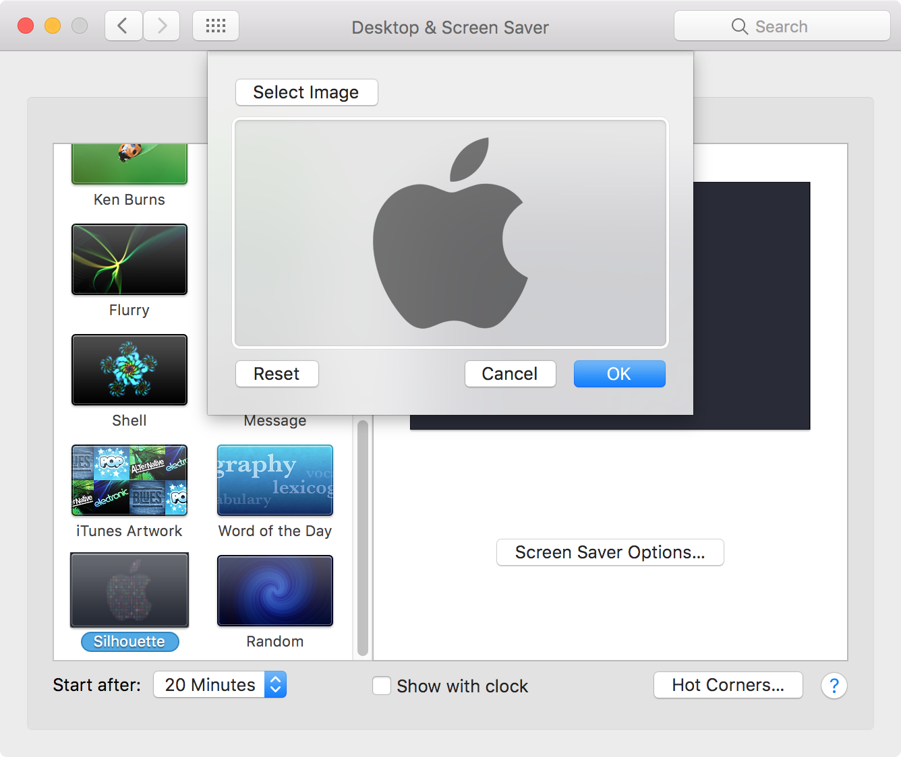

# Silhouette

## Overview

**Silhouette** is a MacOS screen saver written in Swift

## Screenshots

System Preferences - Screen Saver

System Preferences - Screen Saver Options

Screen Saver - Animation

## Contributions

Do you want to improve the app or add any useful features? Please go ahead and create pull requests. I'm thankful for any help.

## License

[MIT](https://github.com/burnsra/SilhouetteSaver/blob/master/LICENSE) © Robert Burns
